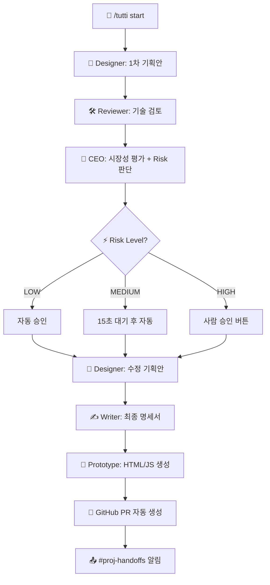

# Tutti — 멀티 에이전트 게임 기획 자동화 봇 설계 문서

> AI 에이전트 4명이 게임을 기획하고, 사용자가 실시간 개입하며, 프로토타입 생성 + GitHub PR까지 자동화하는 디스코드 봇.

---

## 1. 문제 정의

게임 기획 과정은 아이디어 → 기획서 → 기술 검토 → 비즈니스 검토 → 프로토타입까지 여러 역할이 순차적으로 협업해야 한다. 사람이 하면 일주일. 이 전 과정을 AI 에이전트가 2분 만에 자동화하되, 사람이 원하는 시점에 개입(Human-in-the-loop)할 수 있도록 설계한다.

**핵심 가치:** 기획부터 개발팀 핸드오프(GitHub PR)까지 엔드투엔드 자동화.

---

## 2. 사용자 페르소나

- 게임 기획자 또는 개발자
- Discord 서버에서 팀과 협업 중
- AI에게 아이디어를 던지고 즉시 기획서 + 플레이 가능한 프로토타입을 원함
- 기획 완료 시 개발팀에 깔끔하게 핸드오프하고 싶음

---

## 3. 아키텍처

```
┌─────────────────────────────────────────────────────┐
│                    Discord Bot                       │
│  discord_bot.py (슬래시 커맨드, UI, 이벤트 핸들러)     │
└──────────┬──────────┬──────────┬───────────┬────────┘
           │          │          │           │
     ┌─────▼──┐  ┌───▼───┐ ┌───▼───┐  ┌────▼────┐
     │workflow│  │adapters│ │knowledge│ │github_pr│
     │  .py   │  │  .py   │ │  .py   │ │  .py    │
     └───┬────┘  └───┬───┘ └────────┘ └─────────┘
         │           │
    ┌────▼────┐  ┌───▼────────────────────┐
    │pipeline │  │ Mock / Ollama / OpenAI  │
    │  .py    │  │ Anthropic / Google      │
    └─────────┘  └────────────────────────┘
```

### 파일 구조

```
orchestra/
├── discord_bot.py      # 디스코드 봇 진입점 (슬래시 커맨드, UI)
├── discord.py          # 메시지 포맷팅, 워크스페이스 빌더
├── workflow.py         # 파이프라인 오케스트레이션 (에이전트 체이닝)
├── pipeline.py         # 실행 계획(ExecutionPlan) 생성기
├── adapters.py         # LLM 어댑터 (Mock, Ollama, OpenAI, Anthropic, Google)
├── config.py           # 환경 변수 기반 에이전트 설정 로더
├── models.py           # 데이터 모델
├── presets.py          # 실행 프리셋 (fast_draft, balanced, deep_review)
├── prototype.py        # 프로토타입 생성기 (HTML/CSS/JS)
├── knowledge.py        # 영구 지식 베이스 (Global/Project 규칙)
├── github_pr.py        # GitHub PR 자동 생성 (urllib 기반)
├── cli.py              # CLI 인터페이스
├── run_view.py         # 진행 상황 보드 포맷터
├── input_parser.py     # 입력 파서
└── rules/              # 에이전트별 프롬프트 규칙
    ├── shared.md
    ├── designer.md
    ├── reviewer.md
    ├── ceo.md
    └── spec_writer.md
```

---

## 4. 에이전트 파이프라인



---

## 5. 완성된 기능 (v2 현재)

### F1: 슬래시 커맨드 체계 (11개)

| 명령어 | 설명 |
|:---|:---|
| `/tutti start` | 게임 기획 시작 (name + idea) |
| `/tutti revise` | 마지막 기획 수정 |
| `/tutti learn` | 에이전트에게 규칙 학습 |
| `/tutti rules` | 학습된 규칙 목록 |
| `/tutti forget` | 규칙 삭제 |
| `/tutti github` | GitHub PR 연동 가이드 |
| `/tutti settings` | 모델/서버/GitHub 설정 |
| `/tutti apikey` | API 키 등록 (DM) |
| `/tutti status` | 현재 상태 확인 |
| `/tutti help` | 도움말 |
| `/tutti menu` | 온보딩 메뉴 패널 |

### F2: Human-in-the-Loop (HITL)

CEO 리뷰 직후 파이프라인이 멈추고 디스코드에 `[✅ 승인]` / `[✏️ 수정]` 버튼을 표시. 사용자가 결재하면 나머지 파이프라인이 재개됨.

### F3: 위험도 기반 자율 승인

CEO 프롬프트에 `RISK: LOW/MEDIUM/HIGH` 평가 로직 내장.
- **LOW**: HITL 건너뛰고 즉시 자동 승인
- **MEDIUM**: 15초 대기 후 자동 (사용자 개입 가능)
- **HIGH**: 기존 버튼 대기

`/tutti start`와 `/tutti revise` 모두 동일하게 작동.

### F4: 영구 지식 베이스 (Knowledge)

```
knowledge/
├── global_rules.json     ← 모든 프로젝트에 적용
└── projects/
    └── 두더지잡기.json    ← 해당 프로젝트에만 적용
```

에이전트 프롬프트에 `LEARNED_RULES` 환경 변수로 자동 주입.

### F5: 쓰레드 기반 에이전트 대화

`run-*` 쓰레드에서 `@디자이너`, `@리뷰어`, `@ceo`, `@라이터`로 멘션하면 해당 에이전트가 문맥을 유지한 채 응답.

### F6: 프로토타입 안전망 아키텍처

소형 모델(7B)의 한계를 보완:
- AI는 `game.js` 로직에만 집중
- HTML/CSS는 검증된 템플릿 사용
- CSS 안전망으로 AI가 만든 모든 요소에 스타일 강제 적용

### F7: GitHub PR 자동 생성

파이프라인 완료 시 GitHub REST API로:
1. `game/<run-name>` 브랜치 생성
2. 기획서 + 스키마 + 프로토타입 커밋
3. PR 자동 생성 (본문에 기획 요약 포함)
4. `#proj-handoffs`에 PR 링크 알림

외부 의존성 0 (stdlib `urllib` 사용).

### F8: 디스코드 내 환경 설정

모달 UI로 `.env` 수정 없이 실시간 변경:
- 에이전트별 모델/프로바이더
- Ollama URL, 프리셋
- GitHub 레포 설정
- API 키 (DM 전용, 보안)

---

## 6. 기술 결정

| 결정 | 선택 | 이유 |
|:---|:---|:---|
| 봇 프레임워크 | `discord.py` 2.3+ | 슬래시 커맨드 + 모달 + 버튼 지원 |
| LLM 어댑터 | Provider 패턴 | 모델 교체 시 파이프라인 코드 변경 0 |
| 오케스트레이션 | 자체 구현 (`workflow.py`) | LangGraph 등 외부 프레임워크 의존성 제거 |
| 프롬프트 관리 | `rules/` Markdown 파일 | 역할별 분리, 버전 관리 용이 |
| 상태 저장 | 인메모리 Dictionary | v2 단순성 유지 (DB는 향후) |
| GitHub 연동 | stdlib `urllib` 직접 호출 | 외부 의존성 0, `requests` 불필요 |
| 지식 저장 | JSON 파일 (`knowledge/`) | 간결하고 이식 가능 |

---

## 7. 데이터 모델

```python
@dataclass
class DiscordBotState:
    extra_agents: list[dict[str, str]]
    skill_overrides: dict[str, str]
    agent_overrides: dict[str, dict[str, str]]
    last_run: dict[str, str] | None
    server_config: dict[str, str]    # ollama_base_url, preset, GITHUB_GAME_REPO
    api_keys: dict[str, str]         # OPENAI_API_KEY, GOOGLE_API_KEY, GITHUB_TOKEN

@dataclass
class DesignReviewStage:
    idea: str
    messages: list[AgentMessage]
    risk_level: str                  # LOW, MEDIUM, HIGH
    artifact_dir: Path

@dataclass
class PRResult:
    pr_url: str
    branch_name: str
    files_pushed: list[str]
```

---

## 8. 디스코드 채널 구조

```
📁 project-orchestra-demo (카테고리)
  ├── #proj-runs          ← 에이전트 토론 (메인 채널)
  │    └── 🧵 run-1to50-game   ← 개별 기획 세션
  │    └── 🧵 run-dino-run     ← 다른 기획 세션
  └── #proj-handoffs      ← 최종 산출물 + GitHub PR 링크

#tutti-docs              ← 봇 가이드 (서버 입장 시 자동 생성)
```

---

## 9. 향후 로드맵

### 🟡 P1 — DB 영구 저장
- SQLite/PostgreSQL로 서버별 설정, 기획 이력, 학습 규칙 영구 보존
- 봇 재시작 시 상태 유지
- 예상 난이도: 중 (1~2일)

### 🟢 P2 — Jira/Linear 연동 (태스크 자동 분해)
- 최종 명세서를 파싱하여 Epic + Task 단위로 자동 분해
- Jira/Linear API를 통해 스프린트 백로그에 직접 티켓 생성
- 기획→개발 핸드오프를 PR뿐 아니라 프로젝트 관리 도구까지 확장
- 예상 난이도: 중 (2~3일)

### 🟢 P2 — 타겟 엔진 스캐폴딩
- 현재 HTML/JS 프로토타입 외에 Unity C#, React, Godot GDScript 등 실제 게임 엔진 코드 생성
- `/tutti settings`에서 타겟 엔진 선택
- 예상 난이도: 높 (1주)

### 🔵 P3 — 멀티 모달 기획 (이미지/음성 입력)
- 사용자가 스케치 이미지를 업로드하면 Designer가 참고하여 기획
- 음성 메시지로 아이디어를 말하면 STT → 기획 시작
- 예상 난이도: 높 (1주)

### 🔵 P3 — 실시간 프로토타입 미리보기
- 프로토타입 HTML을 외부 호스팅(Vercel/Netlify)에 자동 배포
- 디스코드 메시지에 플레이 가능한 URL 링크 제공
- 예상 난이도: 중 (1~2일)

### 🔵 P3 — 에이전트 성능 대시보드
- 에이전트별 응답 시간, 토큰 사용량, 성공률 추적
- 디스코드 임베드 또는 웹 대시보드로 시각화
- 예상 난이도: 중 (2~3일)

---

## 10. 테스트 전략

- 기존 통합 테스트 유지 (`tests/test_orchestra_core.py`)
- Mock 모드로 전체 파이프라인 E2E 검증
- GitHub PR 모듈: 단위 테스트 (API 호출 mocking)
- 프로토타입 생성: JS 최소 검증 (100자 이상, `getElementById` 포함)
- CLI 모드: 디스코드 없이 파이프라인 단독 실행 검증

---

## 11. 환경 변수 (.env)

```env
# 필수
DISCORD_BOT_TOKEN=your_bot_token_here

# 모드 (mock | ollama | api)
AGENT_MODE=ollama

# Ollama
OLLAMA_BASE_URL=http://localhost:11434

# 에이전트별 모델 오버라이드
DESIGNER_MODEL=qwen2.5-coder:7b-instruct
REVIEWER_MODEL=qwen2.5-coder:7b-instruct
CEO_MODEL=qwen2.5-coder:7b-instruct
SPEC_WRITER_MODEL=qwen2.5-coder:7b-instruct

# 프리셋
AGENT_PRESET=balanced

# API 키 (선택, 디스코드 내 /tutti apikey로도 설정 가능)
OPENAI_API_KEY=sk-...
GOOGLE_API_KEY=AIza...

# GitHub PR (선택, /tutti settings 및 /tutti apikey로도 설정 가능)
GITHUB_GAME_REPO=owner/tutti-game-artifacts
GITHUB_TOKEN=ghp_...
```
