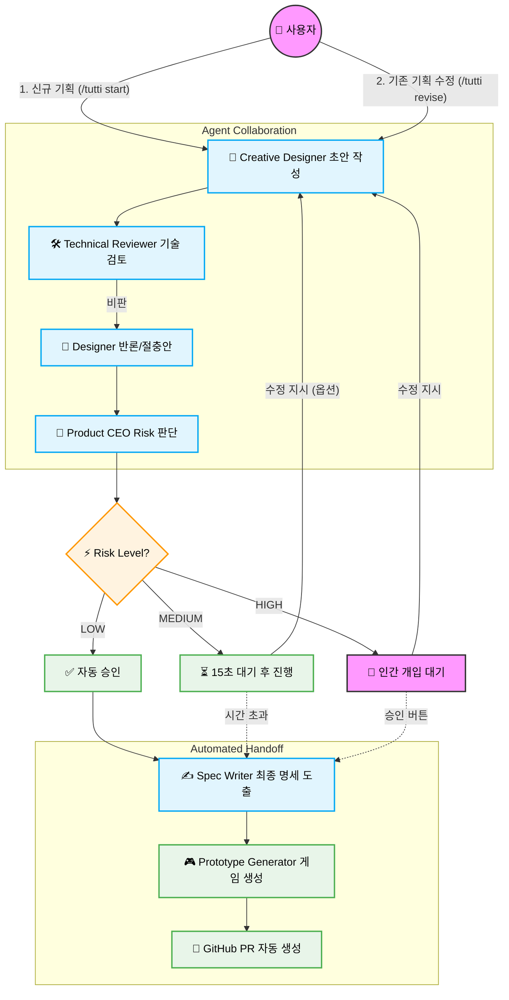

<div align="center">

# 🎮 Orchestra (Tutti)
**Multi-Agent Game Design Studio with Human-in-the-Loop**

[](https://www.python.org/downloads/)
[](https://opensource.org/licenses/MIT)
[](#)
[](#)

> **"아이디어 하나가 2분 만에 기획서, 플레이 가능한 프로토타입, 그리고 GitHub PR로 변환됩니다."**  
> 4명의 AI 에이전트가 협업하고, 사람이 실시간으로 지휘(Orchestrate)하는 차세대 게임 기획 프레임워크.

[제출 안내(SUBMISSION)](SUBMISSION.md) · [CLI 가이드](Tutti_CLI_Guide.md) · [Discord 가이드](Tutti_Discord_Guide.md) · [설계 문서(DESIGN)](DESIGN.md)

</div>

---

## ✨ 왜 Orchestra인가요? (Key Features)

- 🤖 **다중 역할 에이전트 (Multi-Agent System)**
  - `Creative Designer`, `Technical Reviewer`, `Product CEO`, `Spec Writer`가 각자의 역할과 컨텍스트를 가지고 상호 검토하며 기획안을 고도화합니다.
- 🛑 **완벽한 통제권, Human-in-the-loop (HitL)**
  - AI가 통제 불능 상태로 폭주하지 않습니다. 리스크(Risk)에 따라 파이프라인이 일시 정지되며, 인간(사용자)이 실시간으로 피드백을 주입해 방향을 틉니다.
- 🚀 **End-to-End 자동화 (Idea to PR)**
  - 기획이 승인되면 즉시 Markdown 명세, JSON 스키마, 그리고 **플레이 가능한 HTML/JS 프로토타입**을 생성하여 브랜치를 따고 **GitHub PR까지 자동 생성**합니다.
- 🔌 **Plug & Play 모델 (Provider Agnostic)**
  - API 키 없이 즉시 실행 가능한 `Mock` 모드부터, 완전 오프라인 로컬 LLM인 `Ollama`, 그리고 `OpenAI/Gemini` 클라우드 모델까지 자유롭게 스위칭 가능합니다.

---

## 🏗️ 시스템 파이프라인 (Architecture)



---

## 🚀 빠른 시작 (Quick Start)

### 1. 설치

Python 3.11 이상이 필요합니다.

```bash
git clone https://github.com/lowshot31/Orchestra-Game-Spec.git
cd Orchestra-Game-Spec

# 가상환경 생성 및 활성화 (Windows)
py -3 -m venv .venv
.\.venv\Scripts\Activate.ps1

# macOS / Linux
# python3 -m venv .venv && source .venv/bin/activate

# 의존성 설치
pip install -r requirements.txt
```

### 2. 환경변수 설정

```bash
cp .env.example .env
```
> **Tip:** API 키나 복잡한 설정 없이도 기본 `mock` 모드로 즉시 데모 실행이 가능합니다.

### 3. 가장 빠른 데모 실행 (CLI)

```bash
python -m orchestra.cli --idea "한 손으로 플레이하는 1분 리듬 게임"
```
터미널에서 4명의 에이전트가 토론하는 과정을 실시간으로 볼 수 있습니다. 기획이 멈췄을 때 텍스트를 입력해 직접 개입(Intervention)해 보세요!

---

## 🎮 주요 인터페이스

### 1. 팀 협업용 Discord 봇 (Tutti)
> 비개발 직군(기획자, PM)도 슬래시 커맨드로 에이전트 팀을 지휘할 수 있습니다.

```bash
# .env에 DISCORD_BOT_TOKEN 입력 후 실행
python -m orchestra.discord_bot
```
- `/tutti start idea:우주 공룡 게임`: 기획 파이프라인 시작
- **쓰레드 멘션 대화**: 생성된 전용 쓰레드에서 `@디자이너 장애물은 소행성으로 바꿔` 와 같이 개별 에이전트와 소통
- **인게임 UI**: 환경 설정 모달, 승인/수정 버튼 등 직관적인 디스코드 UI 제공
- 📖 [Tutti 디스코드 상세 가이드 보기](Tutti_Discord_Guide.md)

### 2. 고급 터미널 제어 (CLI)
> 개발자를 위한 강력한 명령줄 인터페이스입니다.

```bash
# 사용자 개입 포함 강제 실행
python -m orchestra.cli --idea "병합 퍼즐 게임" --intervention "라이브옵스 요소는 제외"

# GitHub PR 자동 생성 연동
python -m orchestra.cli --idea "우주 공룡 게임" --github-repo "owner/repo" --github-token "ghp_..."

# Ollama를 활용한 완전 오프라인 로컬 LLM 구동
python -m orchestra.cli --mode ollama
```

---

## 📂 산출물 구조 (Artifacts)

기획 파이프라인이 종료되면 `artifacts/cli/playable/<run-name>/` 경로에 다음 파일들이 자동으로 생성됩니다. (Discord 봇은 Discord 전용 폴더에 생성)

| 파일명 | 설명 |
| :--- | :--- |
| `final_game_spec.md` | 최종 게임 기획 명세서 (마크다운) |
| `game_schema.json` | 시스템 연동을 위한 구조화된 게임 데이터 스키마 |
| `message_log.json` | 에이전트 및 사용자의 모든 발화/메시지 교환 로그 |
| **`game/index.html`** | **즉시 플레이 가능한 프로토타입 게임 (클릭하여 실행)** |

---

## 🛠️ 기술 스택 (Tech Stack)

- **Language:** Python 3.11+
- **Agent Orchestration:** 자체 구현 Workflow Engine (의존성 최소화)
- **Interface:** `discord.py` 2.3+ (Bot), `argparse` (CLI)
- **LLM Support:** Mock (내장), Ollama (Local), OpenAI / Anthropic / Google Gemini (Cloud)
- **CI/CD Mocking:** GitHub REST API (stdlib `urllib` 사용, 외부 라이브러리 Zero)

---

## 🤖 에이전트 활용 선언

이 프로젝트는 개발 과정 전반에 걸쳐 **AI 코딩 에이전트(Codex, Gemini)**를 적극적으로 페어 프로그래머로 활용했습니다. 단순 코드 완성을 넘어 아키텍처 설계, 모듈 구현, 문서화에 이르기까지 AI와 인간의 협업으로 완성된 결과물입니다.

- 📖 [스킬 및 서브에이전트 사용 내역 보기](docs/design/skill-and-subagent-usage.md)
- 📝 제출 관련 세션 로그 안내는 [SUBMISSION.md](SUBMISSION.md)를 참고하세요.

<div align="center">
  <sub>Built with ❤️ and AI Agents.</sub>
</div>
